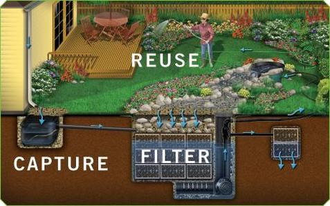

Community gardens in NYC can remain eco-friendly by participating in practices like composting, aquaponics, rain harvesting, and solar panels. This also provides an opportunity for community members and educational programs to participate in these practices and learn more about agricultural activities that support renewable waste and energy. These practices are another important aspect of urban agriculture and further emphasize the value of community gardens. 

They are defined as follows: 
_Composting_: recycling food waste or other organic material and making it into a fertilizer to reduce landfill waste and improve the quality of soil
Rain Harvesting: harvesting rainwater and using it to water plants 
_Aquaponics_: An aquaculture technique in which fish waste supplies nutrients for soil-less plants, which in turn purify the water for the fish.
_Solar panels_: Collect solar energy to power electricity in order to reduce greenhouse gas emissions and promote air quality. 

 
 

## **Overall Distribution of Eco-Friendly Practices Across Boroughs**
How does the spread of eco-friendly practices differ by borough? Check out the histogram below to learn more! 

```{r, message=FALSE, warnings=FALSE, fig.keep=TRUE }
#loading libraries

library(readr)
library(tidyverse)
library(dplyr)
library(ggplot2)
library(leaflet)
library(crosstalk)
library(rvest)
library(httr)
library(plotly)
library(modelr)
library(mgcv)

#loading datasets
garden_info = 
  GET("http://data.cityofnewyork.us/resource/p78i-pat6.csv") |> 
  content("parsed") |>
  janitor::clean_names() |>
  drop_na() |>
   mutate(
    borough = 
      recode(
        borough,
        "B" = "Brooklyn",
        "M" = "Manhattan",
        "X" = "Bronx",
        "R" = "Staten Island",
        "Q" = "Queens"
      )
   )

site_visits = 
  GET("http://data.cityofnewyork.us/resource/xqbk-beh5.csv") |>
  content("parsed") |>
  janitor::clean_names()

#merging and cleaning data for analysis of eco-friendly practices
site_visits_eco_friendly = site_visits |>
  select(parksid, inspectionid, rainharvesting, composting, aquaponics, solarpanels) |>
 mutate_at(c('rainharvesting', 'composting', 'aquaponics', 'solarpanels'), as.numeric) 

eco_friendly_df= 
  inner_join(garden_info, site_visits_eco_friendly, by = "parksid") 

#Grouping Eco-friendly practices by borough for analysis 
eco_friendly_df = eco_friendly_df |>
  group_by(borough) |>
  mutate(
  "RainHarvesting" = sum(rainharvesting),
  "Composting" = sum(composting),
  "Aquaponics" = sum(aquaponics),
  "Solarpanels" = sum(solarpanels),
  )

#Histogram: Overall Distribution of Eco-Friendly Practices Across Boroughs
#reshaping data to plot 
eco_friendly_tidy <- eco_friendly_df |>
  select(borough, RainHarvesting, Composting, Aquaponics, Solarpanels) |>
  pivot_longer(cols = c(RainHarvesting, Composting, Aquaponics, Solarpanels),
               names_to = "Practice",
               values_to = "Count")

#plotting the multipart histogram 
plot2 = ggplot(eco_friendly_tidy, aes(x = borough, y = Count, fill = Practice)) +
  geom_bar(stat = "identity", position = "dodge") +
  labs(
    title = "Distribution of Eco-Friendly Practices Across Boroughs",
    x = "Borough",
    y = "Number of Gardens that Engage in Eco-Friendly Practices",
    color = "Eco-Friendly Practices",
    caption = "Data from NYC Open Data"
  ) +
    viridis::scale_fill_viridis(
    name = "Eco-Friendly Practices", 
    discrete = TRUE
  )

ggplotly(plot2)
``` 

## **Map of Community Gardens with Eco-Friendly Practices**
```{r, message=FALSE, warnings=FALSE, fig.keep=TRUE}
#Interactive Map: Gardens of NYC  
map_data <- eco_friendly_df |>
  select(
    garden_name = gardenname, 
    latitude = lat, 
    longitude = lon, 
    Location = address,
    borough, RainHarvesting, Composting, Aquaponics, Solarpanels
  ) |>
  mutate(
    practices = paste0(
      ifelse(RainHarvesting > 0, "RainHarvesting, ", ""),
      ifelse(Composting > 0, "Composting, ", ""),
      ifelse(Aquaponics > 0, "Aquaponics, ", ""),
      ifelse(Solarpanels > 0, "Solarpanels", "")
    )
  )

map2 = leaflet(map_data) |>
  addTiles() |>
  setView(
    lng = -74.006,  # Longitude of NYC center
    lat = 40.7128,  # Latitude of NYC center
    zoom = 11  # NYC zoom level
    )|>
  addCircleMarkers(
    ~longitude, ~latitude,
    label = ~paste(garden_name, Location, practices),
    popup = ~paste0("<b>", garden_name, "</b><br>Borough: ", borough, "<br>Practices: ", practices),
    color = "green",
    radius = 6,
    fillOpacity = 0.8
    )

map2
```


## **Statistical Analyses: The Association between Borough and Eco-Friendly Practices**

Statistical analyses included a chi-Square test of independence to examine the association between borough and the presence of eco-friendly practices, complemented by several logistic regression analyses to model the probability of a garden engaging in eco-friendly practices based on its borough. 

### _Chi-Square Test of independence on association between borough and presence of eco-friendly practices_

A Chi-Square test of independence was conducted to investigate the association between borough and the presence of eco-friendly practices, aiming to determine whether the presence of these practices in a garden was independent of its borough. It was hypothesized that there would be a strong association between gardens practicing eco-friendly practices and borough. The results (X^2 = 153.11, p-value < 2.2e-16) indicate a strong association between eco-friendly gardens and the boroughs they are located in. 

```{r, message = FALSE, warnings = FALSE, fig.keep = TRUE}
#Creating new binary variable for eco-friendly practices 
eco_friendly_df <- eco_friendly_df |>
  mutate(
    eco_friendly = ifelse(
      RainHarvesting > 0 | Composting > 0 | Aquaponics > 0 | Solarpanels > 0, 
      1, 
      0
    )
  ) 

table7 = eco_friendly_df |>
  mutate(
    eco_friendly = factor(eco_friendly),
    borough = factor(borough)
  ) |>
  select(eco_friendly, borough) |>
  table() |>
  chisq.test()

table7
```

To further investigate, several logistic regression analyses were performed to model the probability of each eco-friendly practice being used by gardens based on the borough they are located in. It was hypothesized that there is an association between borough and gardens with eco-friendly practices. The specific findings for each analysis is as follows:  

### _Logistic Regression Analyses modeling probability of a garden engaging in rain harvesting based on borough_

```{r, message = FALSE, warning = FALSE, fig.keep=TRUE}
#logistic regression model for presence of eco-friendly practices by borough
logistic_df =
  eco_friendly_df |>
  select('rainharvesting', 'composting', 'aquaponics', 'solarpanels', 'borough') |>
  drop_na()  |>
  mutate(
    borough = fct_relevel(borough, "Bronx")
  ) |>
  filter(!(borough=="Staten Island"))

#Rainharvesting 
logistic_rainharvesting = 
  logistic_df |>
  glm(rainharvesting~ borough, data = _, family = binomial())|>
  broom::tidy() |> 
  mutate(OR = exp(estimate)) |>
  select(term, log_OR = estimate, OR, p.value) |> 
  knitr::kable(digits = 3)

logistic_rainharvesting
``` 

### _Logistic Regression Analyses modeling probability of a garden engaging in composting based on borough_

```{r, message = FALSE, warning = FALSE, fig.keep=TRUE}
#Composting 
logistic_composting = 
  logistic_df |>
  glm(composting~ borough, data = _, family = binomial()) |>
  broom::tidy() |> 
  mutate(OR = exp(estimate)) |>
  select(term, log_OR = estimate, OR, p.value) |> 
  knitr::kable(digits = 3)

logistic_composting
```

### _Logistic Regression Analyses modeling probability of a garden engaging in solar panels based on borough_
```{r, message = FALSE, warning = FALSE, fig.keep=TRUE}
#Solarpanels 
logistic_solarpanels = 
  logistic_df |>
  glm(solarpanels~ borough, data = _, family = binomial()) |> 
  broom::tidy() |> 
  mutate(OR = exp(estimate)) |>
  select(term, log_OR = estimate, OR, p.value) |> 
  knitr::kable(digits = 3) 

logistic_solarpanels
```

The findings indicated that gardens in Brooklyn were most likely to implement rain harvesting, with an odds ratio of 2.10 (p = 0.04). In Manhattan, gardens showed a strong inclination towards composting, with an odds ratio of 5.30 (p = 0.00). However, the use of solar panels had an odds ratio of 0.667, which was not statistically significant, as indicated by a p-value greater than 0.05. Aquaponics and Staten Island were excluded from the logistic regression models as Staten Island only had three gardens, not enough gardens in New York City engaged in aquaponics. 

```{r}
logistic_df_tidy = logistic_df %>% filter(!(borough == "Staten Island"))
cv_df <- crossv_mc(logistic_df_tidy, n = 100) %>% 
  mutate(
    train = map(train, as_tibble),
    test = map(test, as_tibble)
  )

# Add Logistic Models and Compute Accuracy
cv_df_accuracy <- cv_df %>% 
  mutate(
    # Add pre-trained models
    mod_rainharvesting = map(train, ~ glm(rainharvesting ~ borough, data = .x, family = binomial(), control = glm.control(maxit = 50))),
    mod_composting = map(train, ~ glm(composting ~ borough, data = .x, family = binomial(), control = glm.control(maxit = 50))),
    mod_aquaponics = map(train, ~ glm(aquaponics ~ borough, data = .x, family = binomial(), control = glm.control(maxit = 50))),
    mod_solarpanels = map(train, ~ glm(solarpanels ~ borough, data = .x, family = binomial(), control = glm.control(maxit = 50)))
  ) %>% 
  mutate(
    # Compute accuracy for each model and test set
    rmse_rainharvesting  = map2_dbl(mod_rainharvesting, test, \(mod, df) rmse(model = mod, data = df)),
    
    rmse_composting = map2_dbl(mod_composting, test, \(mod, df) rmse(model = mod, data = df)),
    
    rmse_aquaponics = map2_dbl(mod_aquaponics, test, \(mod, df) rmse(model = mod, data = df)),
    
    rmse_solarpanels = map2_dbl(mod_solarpanels, test, \(mod, df) rmse(model = mod, data = df))
  )


residualsplot = cv_df_accuracy %>%  
  select(starts_with("rmse")) %>% 
  pivot_longer(
    everything(),
    names_to = "model", 
    values_to = "rmse",
    names_prefix = "rmse_") %>% 
  mutate(model = fct_inorder(model)) %>% 
  ggplot(aes(x = model, y = rmse)) + geom_violin() +
  labs(title = "RMSE Comparison of Logistic Models", y = "RMSE", x = "Model")

ggplotly(residualsplot)


```

