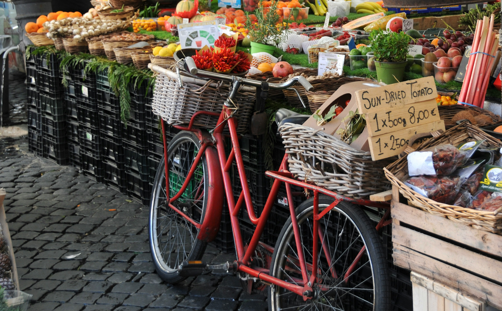

<div style="text-align: center;">
  
</div>

A visit to a NYC garden means you may get to experience food, open lawns, murals, farmer's markets, or ponds, among other things. How exciting!
Before we take a deeper dive, let's take a look at which boroughs have the greatest numbers of garden amenities.
```{r, message=FALSE, warnings=FALSE, fig.keep=TRUE }
library(readr)
library(tidyverse)
library(dplyr)
library(ggplot2)
library(stringr)
library(httr)
library(plotly)
library(nnet)
options(scipen = 999)  # Turn off scientific notation globally
gardeninfo = read_csv("./GreenThumb_Garden_Info.csv") %>% janitor::clean_names()
gardenamenities = read_csv("./GreenThumb_Site_Visits.csv") %>% janitor::clean_names()

info_tidy = gardeninfo %>% select(borough, gardenname, parksid, status, juris) %>% 
  mutate(borough = recode(borough,
                          "B" = "Brooklyn",
                          "X" = "Bronx",
                          "M" = "Manhattan",
                          "Q" = "Queens",
                          "R" = "Staten Island"))
amenities_tidy = gardenamenities %>% select(parks_id, open_lawn_or_communal_area, murals, farmers_market, pond, food, inspection_id) %>% rename(parksid = parks_id)

#merging data
garden_merged = full_join(amenities_tidy, info_tidy, by= "parksid", relationship = "many-to-many") 

#removing duplicates
#info_tidy %>% select(parksid) %>% duplicated()
#amenities_tidy %>% select(parksid) %>% unique()
#garden_merged[duplicated(garden_merged) | duplicated(garden_merged, fromLast = TRUE), ]
garden_merged = garden_merged[!duplicated(garden_merged), ]


#creating amenity count table
amenity_count = garden_merged %>%
  pivot_longer(cols = c(open_lawn_or_communal_area, murals, farmers_market, pond, food), names_to = "Amenity", values_to = "True_False") %>% 
  filter(True_False == TRUE) %>% 
  group_by(Amenity) %>% 
  count(name = "total_gardens")


#amenity count by borough
amenity_count_borough = garden_merged %>%
  pivot_longer(cols = c(open_lawn_or_communal_area, murals, farmers_market, pond, food), names_to = "Amenity", values_to = "True_False") %>% 
  select(borough, Amenity, True_False) %>% 
  filter(True_False == TRUE) %>% 
  group_by(borough, Amenity) %>%
  summarise(num_amenities = n(), .groups = "drop") %>% 
  group_by(borough) %>% 
  mutate(total_amenities = sum(num_amenities)) %>% 
    ungroup()
  
table1 = amenity_count_borough %>% select(borough, total_amenities) %>% unique() %>% 
  knitr::kable(col.names = c("Borough", "Total Amenities"),
               label = "Total Number of Garden Amenities by Borough")
  

table1
```

Brooklyn leads with the greatest number of garden amenities! Go Brooklyn!


## Looking At Different Amenities
Let's check out how many gardens have each type of amenity.

Here's a histogram of the number of gardens with each of the features: open lawn/communal area, murals, pond, farmer’s market, food.
```{r, message=FALSE, warnings=FALSE, fig.keep=TRUE}
plot1 = amenity_count %>% 
  mutate(Amenity = recode(Amenity,
                          "farmers_market" = "Farmer's Market",
                          "food" = "Food",
                          "murals" = "Murals",
                          "open_lawn_or_communal_area" = "Open Lawn/Communal Area",
                          "pond" = "Pond")) %>% 
  ggplot(aes(x = Amenity, y = total_gardens, fill = Amenity)) +
  geom_col() +
  labs(title = "Number of Gardens by Type",
       x = "Amenity Type",
       y = "Total Number of Gardens") +
  scale_fill_brewer(palette = "PRGn") +
  theme(panel.background = element_rect(fill = "transparent")) +
  theme(axis.text.x = element_text(angle = 45, hjust = 1))

ggplotly(plot1)
```


It seems like food and an open lawn/communal area are the most popular types of garden amenities. Time to go have a picnic.


## Garden Amenities Distribution by Borough
Have you ever wondered which boroughs have the most garden amenities? We certainly did!
Here is a histogram showing the count of each amenity we can find in every borough.
```{r}

plot2 = amenity_count_borough %>%
  mutate(Amenity = recode(Amenity,
                          "farmers_market" = "Farmer's Market",
                          "food" = "Food",
                          "murals" = "Murals",
                          "open_lawn_or_communal_area" = "Open Lawn/Communal Area",
                          "pond" = "Pond")) %>% 
  ggplot(aes(x = Amenity, y = num_amenities, fill = borough)) +
  geom_col(position = "dodge") +
  labs(x = "Number of Amenities", y = "Type of Amenity") + 
  theme(axis.text.x = element_text(angle = 45, hjust = 1)) +
  scale_fill_brewer(palette = "PRGn") +
  theme(panel.background = element_rect(fill = "transparent"))


ggplotly(plot2)
```


Brooklyn leads in every garden amenity category, except for ponds. If you want to see a pond, go to Manhattan.

<div style="text-align: center;">
  
</div>


## What Does Money Have To Do With It?
Below is a dot plot of median income in each borough, so we can see where each borough stands before we go into some regressions.

```{r, message=FALSE}
#importing and tidying income dataset

income = read_csv("./censusincome2024.csv") %>% janitor::clean_names()

income_borough = income[2, ] %>% 
  select(bronx_county_new_york_median_income_dollars_estimate,
         	bronx_county_new_york_median_income_dollars_margin_of_error,
         kings_county_new_york_median_income_dollars_estimate,
         kings_county_new_york_median_income_dollars_margin_of_error,
         new_york_county_new_york_median_income_dollars_estimate,
         new_york_county_new_york_median_income_dollars_margin_of_error,
         queens_county_new_york_median_income_dollars_estimate,
         queens_county_new_york_median_income_dollars_margin_of_error,
         richmond_county_new_york_median_income_dollars_estimate,
         richmond_county_new_york_median_income_dollars_margin_of_error) %>% 
  mutate_all(as.character) %>% 
  pivot_longer(cols = everything(), names_to = "column_name", values_to = "value") %>% 
  mutate(
    borough = str_extract(column_name, "^[a-z_]+(?=_county)"),
    metric = ifelse(str_detect(column_name, "estimate"), "median_income", "margin_of_error")
  ) %>%
  select(-column_name) %>% 
  pivot_wider(
    names_from = metric,
    values_from = value
  ) %>% 
  mutate(borough = recode(borough, bronx = 'Bronx', kings = 'Brooklyn', new_york =  'Manhattan', queens = 'Queens', richmond = 'Staten Island' ))

#converting to numeric
income_borough <- income_borough %>%
  mutate(median_income = as.numeric(gsub(",", "", median_income))) %>% 
  mutate(margin_of_error = as.numeric(gsub("[±,]", "", margin_of_error)))

#add columns for MOE
income_borough = income_borough %>% mutate(
  lower_margin = (median_income-margin_of_error),
  upper_margin = (median_income+margin_of_error)
)


#income dsitribution dot plot with MoE
plot3 = income_borough %>% 
  ggplot(aes(x= borough, y = median_income)) +
  geom_col(fill ="white", color = "black") +
  geom_errorbar(aes(ymax = upper_margin, ymin = lower_margin, width = 0.5)) +
  theme_classic()

ggplotly(plot3)
```

Manhattan has the greatest median income, while Bronx has the least. This will come in handy when analyzing how income is associated with garden amenities....


## Poisson analysis
### Looking at total amenities per borough and median income.
A Poisson regression model was run to investigate how median borough income might associate with the total number of amenities available in each borough. The odds ratio of 1 shows that, surprisingly, median income may not have much of an effect of the number of amenities available in each borough. From an equity standpoint, this could be good news; lower income may not directly result in fewer garden amenities. 
```{r, message=FALSE, warnings=FALSE, fig.keep=TRUE}
#POISSON ANALYSIS
#isolating total amenities per borough
total_borough_amenity = select(amenity_count_borough, borough, total_amenities)
total_borough_amenity = total_borough_amenity[!duplicated(total_borough_amenity), ]

#creating new data frame for regression
poisson_df = left_join(income_borough, total_borough_amenity, by="borough") %>% select(borough, median_income, total_amenities)

# Fit the Poisson regression model
poisson_model <- glm(total_amenities ~ median_income, 
                     family = poisson(link = "log"), 
                     data = poisson_df)

table2 = poisson_model %>% broom::tidy() |> 
  mutate(OR = exp(estimate)) |>
  select(term, log_OR = estimate, OR, p.value) |> 
  knitr::kable()

table2
```


## Multinomial Regression
In the multinomial regression below, median income, borough and garden status were evaluated (an active GreenThumb garden or not a GreenThumb garden; as a reminder, GreenThumb is a garden maintenance program).

It was found that being in the GreenThumb program significantly decreases the odds of having garden ponds compared to those not in the program. Gardens in Manhattan and Brooklyn have higher odds of having ponds compared to other boroughs, while median income does not significantly influence the presence of garden ponds. Gardens in Queens have slightly lower odds of having garden ponds, but this difference is not statistically significant.

```{r, message=FALSE, warnings=FALSE, fig.keep=TRUE, echo=FALSE}

multinom_df = left_join(garden_merged, income_borough, by="borough") %>% select(parksid, pond, status, juris, borough, median_income) %>% 
  filter(juris == "DPR") %>% 
  filter(status == "Active" | status == "Not GreenThumb") %>%
  filter(!(borough == "Staten Island")) %>% 
  mutate(pond = ifelse(pond, "Yes", "No")) %>% 
  mutate(status = fct_relevel(status, "Not GreenThumb")) %>% 
  mutate(borough = fct_relevel(borough, "Bronx")) %>% 
  drop_na()

#multinom_df %>% select(status, juris)  %>% group_by(status) %>% count() 
#multinom_df %>% group_by(borough, pond) %>% count() 


multinom_model = nnet::multinom(pond ~ status + median_income + borough, data = multinom_df)

table3 = multinom_model %>% broom::tidy() |> 
  mutate(OR = exp(estimate)) |>
  select(term, log_OR = estimate, OR, p.value) |> 
  knitr::kable()
```

```{r, message=FALSE, warnings=FALSE, fig.keep=TRUE,}
table3
```

