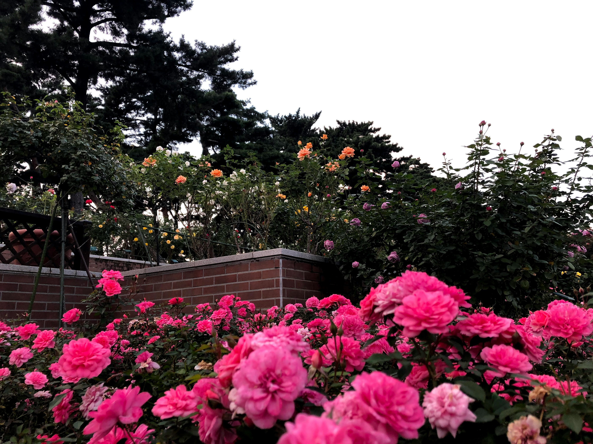

## **About**
New York City's community gardens offer an escape from the hustle and bustle of the city. The majority of gardens were originally abandoned lots that were turned into gardens by volunteers so communities could have a space to socialize, relax, learn, and participate in urban agriculture. They are typically managed by neighborhood residents and provide invaluable open space. They provide a variety of social, economic, and environmental benefits to their communities. They are also an opportunity for education for students and community members alike. Overall, community gardens are an invaluable feature of NYC, offering much-needed green spaces, improving air quality, and contributing to the well-being of its residents!

## **Map of NYC's Community Gardens**
Want to visit a community garden in your area? Or discover a green space in a new neighborhood? Check out the map below!
```{r, message=FALSE, warnings=FALSE, fig.keep=TRUE}
library(readr)
library(tidyverse)
library(dplyr)
library(ggplot2)
library(leaflet)
library(crosstalk)
library(rvest)
library(httr)
library(plotly)

garden_info = 
  GET("http://data.cityofnewyork.us/resource/p78i-pat6.csv") |> 
  content("parsed") |>
  janitor::clean_names() |>
  drop_na() |>
   mutate(
    borough = 
      recode(
        borough,
        "B" = "Brooklyn",
        "M" = "Manhattan",
        "X" = "Bronx",
        "R" = "Staten Island",
        "Q" = "Queens"
      )
   )

site_visits = 
  GET("http://data.cityofnewyork.us/resource/xqbk-beh5.csv") |>
  content("parsed") |>
  janitor::clean_names()

site_visits_eco_friendly = site_visits |>
  select(parksid, inspectionid)

eco_friendly_df= 
  inner_join(garden_info, site_visits_eco_friendly, by = "parksid") 

map_data <- eco_friendly_df |>
  select(
    garden_name = gardenname, 
    latitude = lat, 
    longitude = lon, 
    Location = address,
    borough)

maphome = leaflet(map_data) |>
  addTiles() |>
  setView(
    lng = -74.006,  
    lat = 40.7128,  
    zoom = 11      
  ) |>
  addCircleMarkers(
    ~longitude, ~latitude,
    label = ~paste(garden_name, Location, borough),
    popup = ~paste0("<b>", garden_name, "</b><br>Borough: ", borough),
    color = "green",
    radius = 6,
    fillOpacity = 0.8
  )

maphome
```

## **Our Project**
New York City is infamously known as the concrete jungle with approximately 1 million structures distributed over an era of 778.2 km^2. However, unbeknownst to many, NYC offers more green space than any other major U.S. city. In fact, 99% of New Yorkers live within a 10-minute walk from a green space. Despite this, these areas are often overlooked due to the city's dense, industrial layout. Our team aims to enhance access to and awareness of these green spaces by documenting the location of every garden in NYC and highlighting their features, such as plant and animal life, available amenities, and environmentally friendly practices. We are creating a comprehensive resource to empower NYC residents with this valuable information. 

For information about the plants and animals in NYC's community gardens, take a look at our page on the [Flora and Fauna](florafaunatab.html).

To learn more about the efforts made by community garden volunteers and organizers to promote environmentally conscious activities, check out our page on [Eco-Friendly Practices](ecofriendlytab.html).

Want to visit a garden near you? Take a look at our page on [Garden Amenities](gardenamenitiestab.html) to learn about what different gardens across the city offer!

## **Our Data Sources**

### _NYC Open Data_

[Garden Info](https://data.cityofnewyork.us/dataset/GreenThumb-Garden-Info/p78i-pat6/about_data): This data set provides information about all active community gardens under the jurisdiction of NYC Parks. It informs maintenance and programming planning and confirms that parks are operating in accordance with their licensing requirements. 

[Site Visits](https://data.cityofnewyork.us/Environment/GreenThumb-Site-Visits/xqbk-beh5/about_data): Designated site visitors collect data about the community gardens during annual visits to confirm that they are operating in accordance with their licensing requirements. This data set is the result of their data collection. The data is also used to inform maintenance and programming planning.

[Income 2024](https://www.census.gov/topics/income-poverty/income/data/tables.html): This data set was utilized to understand how median income levels were related to the distribution of garden amenities. It was obtained from the census site and contains data from 2024 specifically. 

### _Other sources_

[Urban Agriculture in NYC Community Gardens](https://agriculture.ny.gov/community-gardens-and-urban-agriculture)

[NYC Parks Green Thumb](https://www.nycgovparks.org/greenthumb/)



## **Site Creators**
Kaylin De Silva (kd2942), Cristina Varela (cev2129), Alishah Khan (ak5098)

